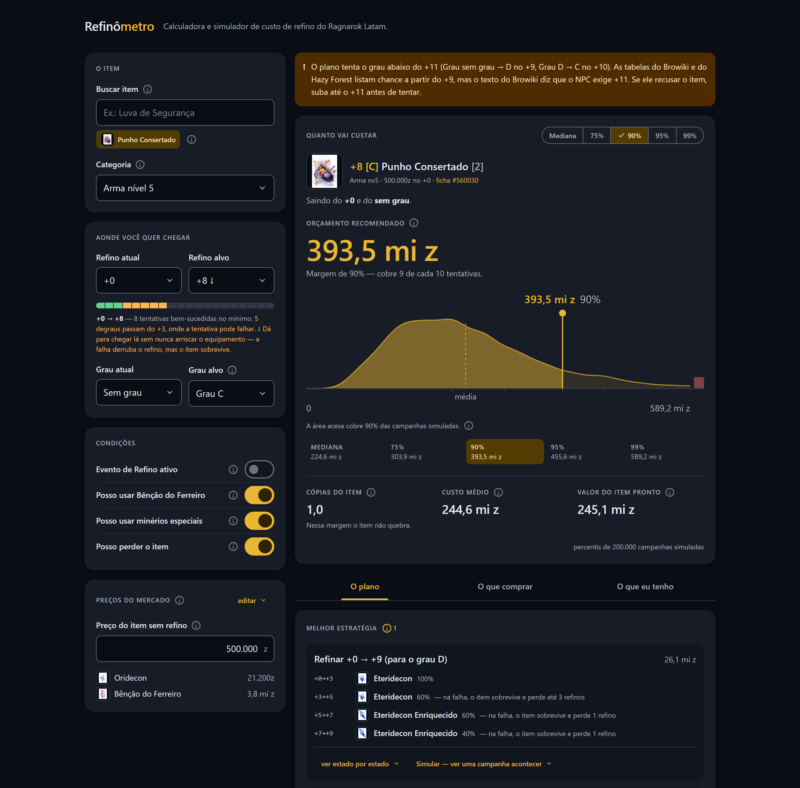

# Refinômetro

[](https://github.com/Fernandohf/refinometro/actions/workflows/ci.yml)
[](https://github.com/Fernandohf/refinometro/actions/workflows/deploy.yml)
[](https://github.com/Fernandohf/refinometro/actions/workflows/base-itens.yml)
[](LICENSE)
[](https://nodejs.org)

<a href="https://www.buymeacoffee.com/fernandohf" target="_blank"></a>

Calculadora e simulador de custo de refino para o Ragnarok Latam. Diz quanto zeny, quantos
minérios e quantas cópias do próprio equipamento você precisa ter em caixa para levar uma arma
ou equipamento até um refino e um grau alvo, qual a melhor estratégia de minérios em cada
faixa, e quanto o item vale no fim.

**[Abrir a calculadora de refino do Ragnarok Latam](https://fernandohf.github.io/refinometro/)**

[](https://fernandohf.github.io/refinometro/)

## Por que não basta multiplicar

Um refino não é uma sequência de tentativas independentes. Uma falha pode destruir o item,
derrubar 1 refino ou derrubar 3, dependendo do minério — então a melhor escolha em cada
nível depende do custo esperado dos níveis vizinhos, inclusive dos que ficam _abaixo_ de
onde você começou. E cada subida de Grau **zera o refino de volta para +0**, o que
transforma "quero Grau A +11" em cinco subidas de refino, não uma.

O motor trata isso como um processo de decisão de Markov e resolve o custo esperado de forma
exata, escolhendo o minério ótimo de cada nível em vez de seguir uma receita fixa. Em cima
disso roda uma simulação de Monte Carlo, que dá os percentis: a distribuição tem cauda longa
e quem se planeja pela média fica sem recursos no meio do caminho quase metade das vezes.

## O que ela faz

- **Estratégia por faixa, não receita fixa.** O minério de cada nível sai de um MDP resolvido
  exatamente, com a taxa do refinador contada por tentativa — é o que faz o Enriquecido
  competir com o Oridecon numa arma nv4. → [O motor](docs/motor.md)
- **Campanhas com Grau.** Subir de grau zera o refino, então o alvo vira várias fases; o motor
  escolhe em que refino tentar, qual processo e quanta Bênção de Éter comprar.
- **Percentis, não só a média.** Quanto custa no caso comum, no ruim e no muito ruim.
- **Modo "não posso perder o item".** Com carta ou encanto, a quebra vira restrição e não
  custo: o motor deriva o piso seguro e recusa o alvo quando não existe caminho.
- **Cópias do equipamento como material.** Na faixa de quebra, o item também é consumo.
- **Comprar × fabricar.** Cada minério é cotado pelo menor entre o mercado e a receita de NPC,
  e a lista de compras vem em duas partes: o que comprar e o que fabricar no balcão.
- **"Dá com o que eu tenho?"** O painel de estoque responde o inverso: dado o seu zeny, os seus
  minérios e as suas cópias, qual a chance de chegar ao alvo.
- **Busca de item por nome**, com a base do Divine Pride do LATAM versionada no repositório —
  funciona offline e sem chave de API. → [Itens](docs/dados-itens.md)
- **Preços seus, salvos no navegador**, com a cotação real do mercado LATAM como palpite
  inicial. → [Preços](docs/dados-precos.md)

O que ela **não** considera (cartas, encantamentos, pergaminhos e martelos) está em
[O motor · O que não é considerado](docs/motor.md#o-que-não-é-considerado).

## Rodando

Precisa de **Node.js 22 ou mais novo** (é a versão que o CI usa) e do npm que vem junto. Na
raiz do repositório:

```bash
npm install       # só na primeira vez, e quando o package.json mudar
npm run dev       # servidor de desenvolvimento em http://localhost:5173
```

O `npm run dev` fica em modo watch: salvou um arquivo, a página atualiza sozinha. Para parar,
`Ctrl+C`.

### Testes e build

```bash
npm test            # testes do motor de cálculo (uma passada, é o que o CI roda)
npm run test:watch  # reexecuta a cada alteração, para desenvolver
npm run typecheck   # só o TypeScript, sem gerar nada
npm run build       # build de produção em dist/
npm run preview     # serve o dist/ para conferir o build antes de publicar
```

Vale saber: `npm run build` roda o `tsc -b` antes do Vite, então erro de tipo derruba o build.
E o `base` do Vite muda entre dev (`/`) e build (`/refinometro/`) — no `preview` o site abre
em `http://localhost:4173/refinometro/`, não na raiz.

São os mesmos três comandos que o CI roda em cada push e em cada pull request (o selo
**Testes** lá em cima) — ver [Publicação](docs/publicacao.md).

Os demais comandos — inspeção pelo terminal e atualização dos dados versionados — estão em
[CONTRIBUTING.md](CONTRIBUTING.md#os-comandos-do-projeto).

## Como contribuir

Toda ajuda serve: um preço errado, um item que a busca não acha, uma chance que não bate com
o jogo, um teste, uma tradução de rótulo. Não é preciso saber TypeScript para reportar que a
conta não fecha in-game — esse tipo de relato é o mais valioso que o projeto recebe.

- **[CONTRIBUTING.md](CONTRIBUTING.md)** — como abrir issue e PR, como o projeto se organiza,
  o que os testes cobrem e as convenções de código e de commit.
- **[Código de conduta](CODE_OF_CONDUCT.md)** — o combinado da convivência.
- **[Boas primeiras contribuições](docs/primeiras-contribuicoes.md)** — tarefas pequenas e
  bem delimitadas, com o caminho até o arquivo certo.

## Documentação

O detalhe todo mora em [docs/](docs/):

| Documento | O que tem lá |
| --- | --- |
| [O motor](docs/motor.md) | O que é calculado, em que ordem, e o que cada decisão muda na tela |
| [A matemática](docs/matematica.md) | A especificação formal: o MDP, as demonstrações e o erro de cada aproximação |
| [A interface](docs/interface.md) | Material Design 3, o botão informativo e a lista de compras |
| [Os dados](docs/dados.md) | A ordem das fontes, e por que ela é essa |
| [Chances e custos](docs/dados-chances.md) | As tabelas oficiais da GNJOY e as divergências registradas |
| [Itens](docs/dados-itens.md) | A base do Divine Pride: varredura, armadilhas e o que não é refinável |
| [Preços](docs/dados-precos.md) | A cotação do mercado LATAM, e por que a média de 30 dias não serve |
| [Publicação](docs/publicacao.md) | Os dois workflows do GitHub Actions |

## Licença

O código está sob a [licença MIT](LICENSE). Os **dados** não são meus e seguem a licença de
quem os publicou — o detalhe está em [Os dados · Proveniência](docs/dados.md#proveniência-e-licença-dos-dados).

Ragnarok Online é da Gravity; este é um projeto de fã, sem vínculo com a Gravity, a GNJOY Latam ou o Divine Pride.

## Apoie

A calculadora é de graça, sem anúncio e sem cadastro. Se ela te poupou zeny ou ajudou suas decisões:

<a href="https://www.buymeacoffee.com/fernandohf" target="_blank"></a>
